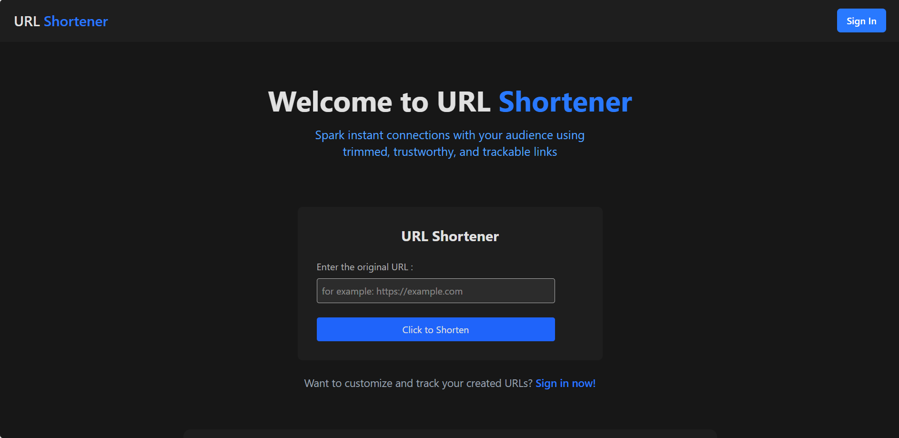
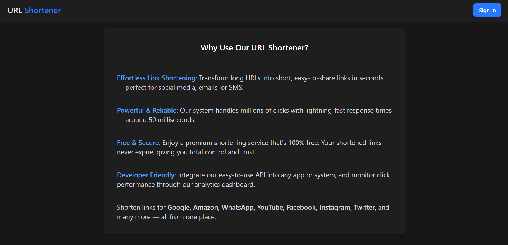
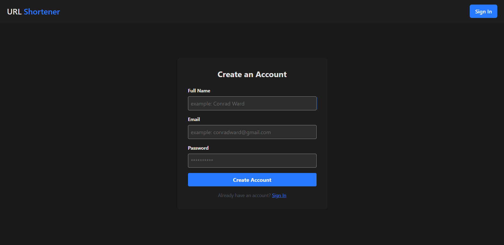
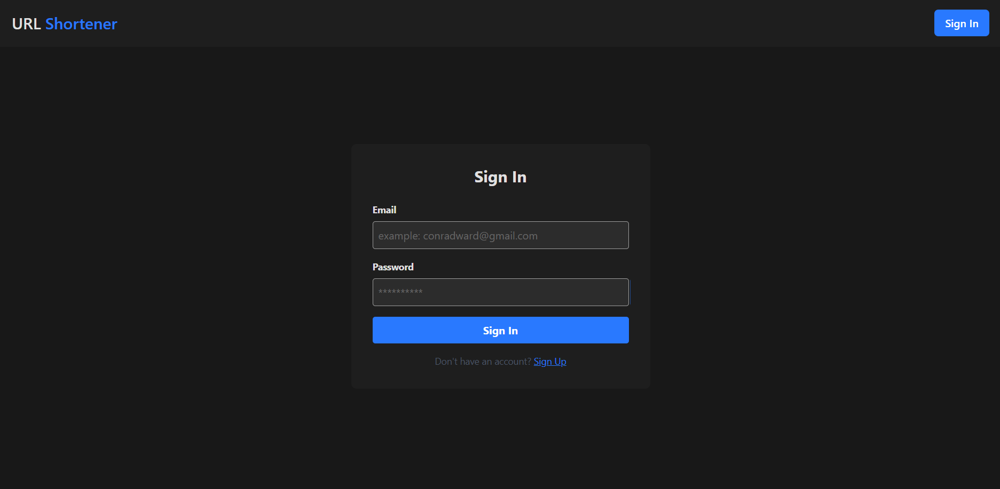
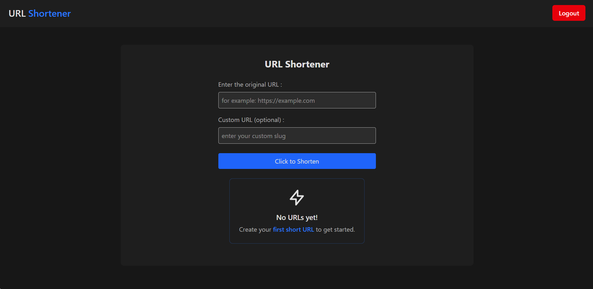
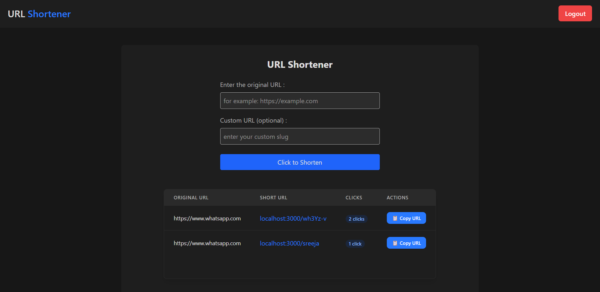
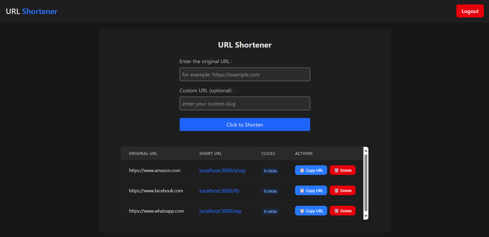

# 🔗 URL Shortener

A simple and responsive **URL Shortener App** built using **MERN Stack (MongoDB, Express, React, Node.js)**.

> ## Features :

#### Basic Features (Available to all users)
- Shorten long URLs instantly  
- **Free access** — no payment required  
- **Copy shortened URL** directly with one click   
- Responsive UI using Tailwind CSS  

#### Log in to access more advanced features
- **View previously generated URLs**  
- **Customize the name** of your short URL  
- **Track the number of clicks** on each link  
- **Delete URL**   
- Login/Signup system for personalized experience 

> ##  Tech Stack :

- **Frontend:** React, Tailwind CSS  
- **Backend:** Node.js, Express  
- **Database:** MongoDB  
- **Authentication:** JWT  

> ## Here's how my URL Shortener looks like :

### Home Page-

### Authentication Page-

### Dashboard-

### Customize your URLs-

### Thank You.